<p align="center">
  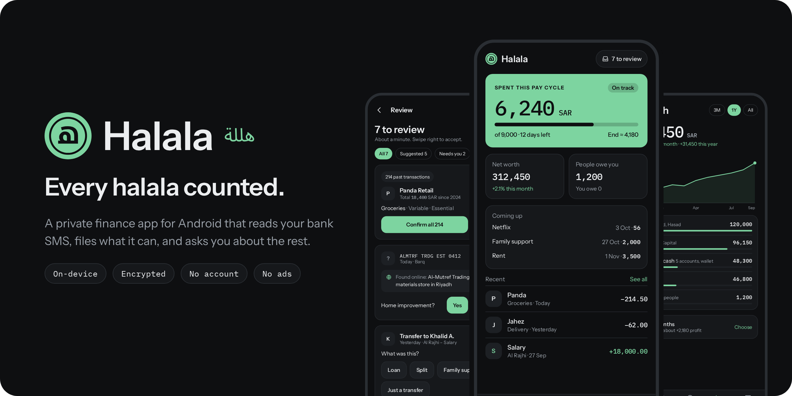
</p>

<p align="center">
  <a href="https://github.com/BassamAlim/halala/actions/workflows/ci.yml"></a>
  <a href="https://github.com/BassamAlim/halala/releases/latest"></a>
  
  
  
  <a href="LICENSE"></a>
</p>

# Halala

**Halala** (هللة, the hundredth of a riyal) is a personal finance app for Android that keeps
itself up to date. It reads the SMS your bank already sends, turns each one into a transaction,
files what it recognises, and leaves you a short inbox of the things only you can answer.

Your ledger never leaves the phone. There is no account to create, no server, no analytics and
no ads. The database is encrypted, the app locks behind your fingerprint, and it is installed
straight from this repository's releases rather than a store.

> The screens below are the design mockups the app is built from. The shipped screens follow
> them closely, with small differences where the product moved on.

## Screens

<table>
  <tr>
    <td width="25%">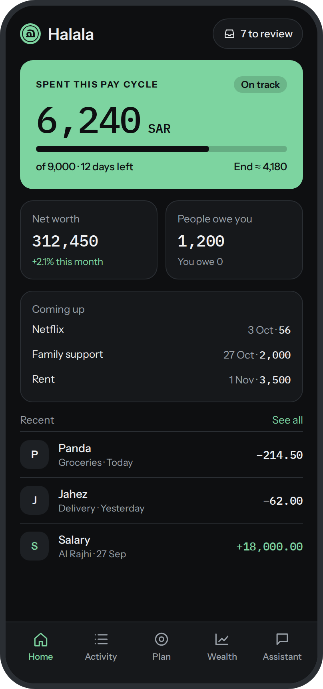</td>
    <td width="25%">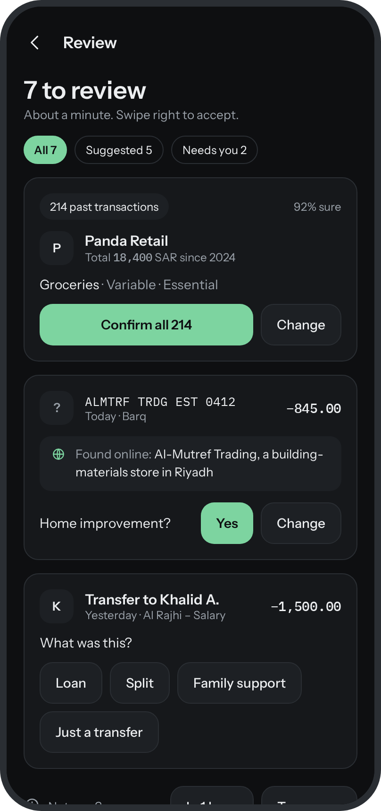</td>
    <td width="25%">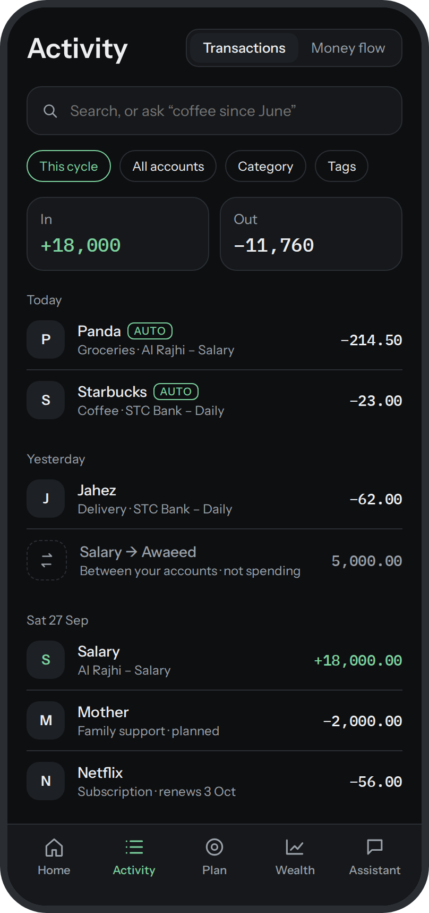</td>
    <td width="25%">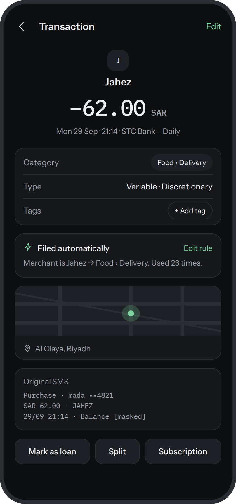</td>
  </tr>
  <tr>
    <td align="center"><b>Home</b><br><sub>This pay cycle, what is coming up, who owes you</sub></td>
    <td align="center"><b>Review</b><br><sub>One card per merchant, one tap to confirm</sub></td>
    <td align="center"><b>Activity</b><br><sub>Every transaction, searchable, with moves kept apart</sub></td>
    <td align="center"><b>Transaction</b><br><sub>What it was, why it was filed, the original SMS</sub></td>
  </tr>
  <tr>
    <td>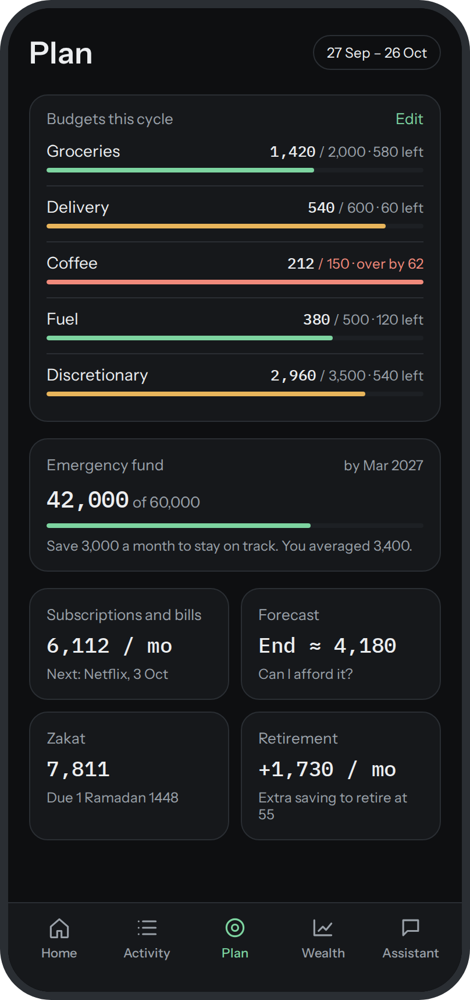</td>
    <td>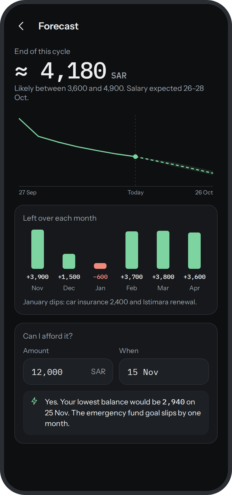</td>
    <td>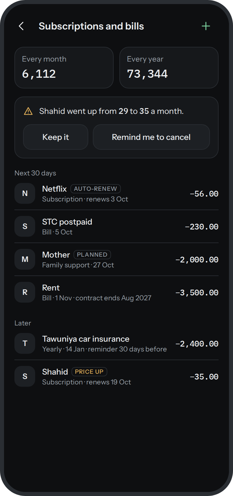</td>
    <td>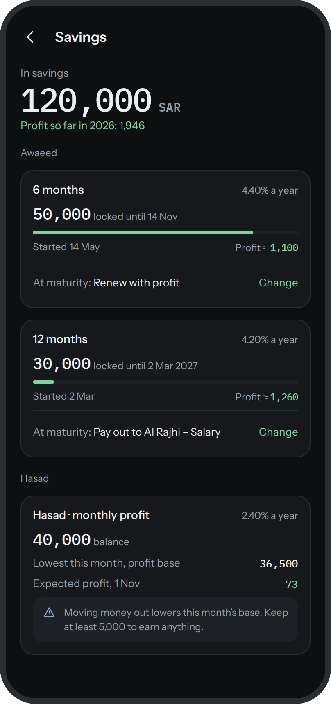</td>
  </tr>
  <tr>
    <td align="center"><b>Plan</b><br><sub>Budgets by pay cycle and savings goals</sub></td>
    <td align="center"><b>Forecast</b><br><sub>Where the cycle ends, and "Can I afford it?"</sub></td>
    <td align="center"><b>Subscriptions and bills</b><br><sub>Found for you, with price rises flagged</sub></td>
    <td align="center"><b>Savings</b><br><sub>Term deposits and their expected profit</sub></td>
  </tr>
  <tr>
    <td>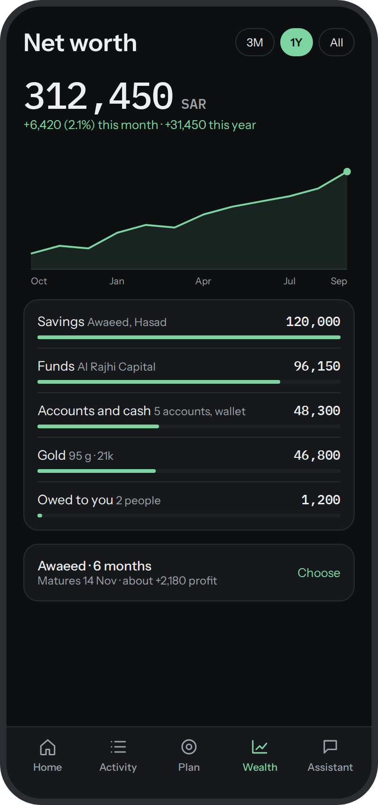</td>
    <td>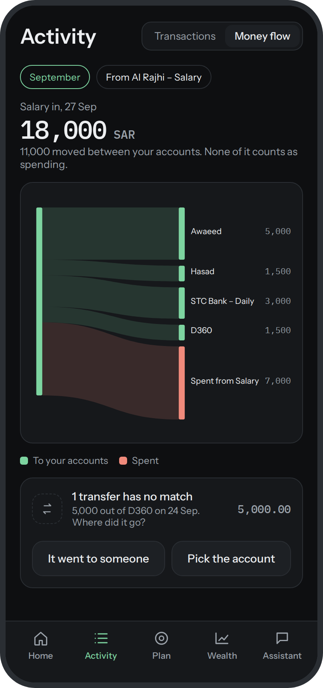</td>
    <td>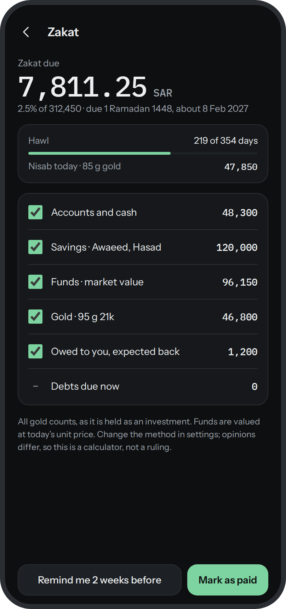</td>
    <td>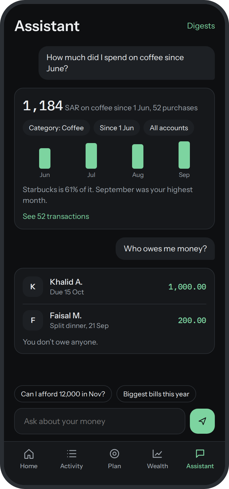</td>
  </tr>
  <tr>
    <td align="center"><b>Net worth</b><br><sub>Accounts, savings, funds, gold and loans in one figure</sub></td>
    <td align="center"><b>Money flow</b><br><sub>Where a month's salary went</sub></td>
    <td align="center"><b>Zakat</b><br><sub>Hawl, nisab and what is due</sub></td>
    <td align="center"><b>Ask</b><br><sub>Questions in plain words, answered on the phone</sub></td>
  </tr>
</table>

## How it works

Rules decide first and the AI is asked second, so most transactions are filed with no network
call at all. The AI only ever identifies a merchant by name. Code decides everything else.

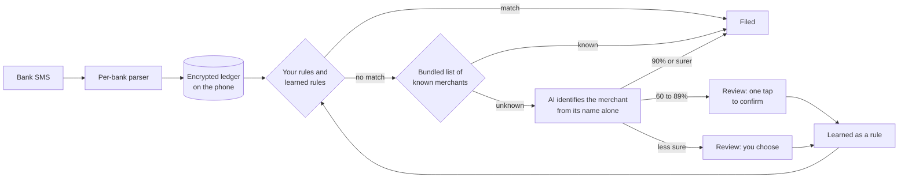

Every automatic decision says why. A transaction names the rule that filed it, what its
merchant was identified as, by whom and how sure, and any of it can be undone.

## What it does

**Keeps the ledger for you**

- Reads bank SMS as they arrive and back-imports your inbox on first run
- Routes each message to the right account by its last four digits, removes duplicates and
  pairs the two sides of a move between your own accounts so it never counts as spending
- Groups every spelling a bank uses for a business into one merchant ("PANDA 1042 RIYADH" is
  Panda)
- A cash wallet you correct by counting it, and manual entry for anything else

**Files it with you, not instead of you**

- Rules you write, rules learned from your answers, and automatic rules for merchants it is
  sure of, in that order of precedence
- A review inbox ordered by what matters most, with swipe to accept
- Web lookup for cryptic merchant names, shown with the page it found
- Full history of filing changes, each one undoable

**Plans ahead**

- Budgets by pay cycle rather than calendar month
- A forecast of where the cycle ends, and "Can I afford it?" for a purchase on a date
- Subscriptions and bills found from your history, with missed charges and price rises flagged
- Savings goals, anomaly alerts, and weekly, monthly and yearly digests

**Sees the whole picture**

- Net worth across accounts, cash, term deposits, funds, gold and money owed
- Loans and splits with people, with reminders you send yourself
- Zakat, retirement and compound interest calculators
- Insights, a money flow diagram, a spending map and tags
- Ask: questions in plain words, answered by a query that runs on the phone

**Colour is meaning.** Spending is never coloured. The one card that changes colour is this
pay cycle's budget: jade under 80%, amber to 100%, coral over.

<p align="center">
  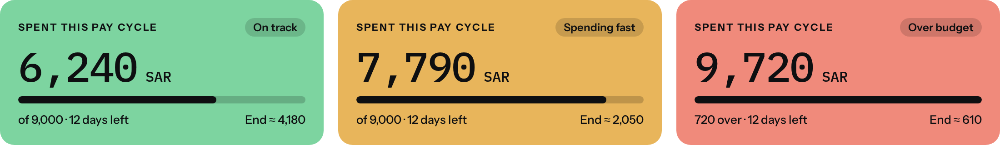
</p>

## Privacy

The phone holds the only copy of your ledger.

- **Encrypted at rest.** The whole database is SQLCipher. Its key is random, wrapped by Android
  Keystore, and never leaves the device.
- **Locked.** Biometric lock on every cold start and after a minute away. Screenshots are
  blocked and the app is blank in recents. Hide amounts turns every figure into `••••`.
- **No cloud.** Android backup is off. Data moves only by your own export (CSV or JSON) or an
  encrypted `.halala` backup, sealed with AES-256-GCM under a passphrase stretched by Argon2id,
  with a recovery key.
- **No analytics, no crash reporter, no ads, no account.**

What does leave the phone, and nothing else:

| Goes to | What is sent | Why |
| --- | --- | --- |
| Groq | A merchant's name as the bank wrote it | To identify what kind of business it is, and its website |
| Tavily | A merchant's name and the country | To look up a name the AI was unsure of |
| Google's icon service | A merchant's website domain | To fetch its logo |
| Groq | The names banks wrote for people you transfer with | To find one person under two names |
| Groq | The question you type and today's date | Ask turns it into a query that runs on the phone |
| Public price sources | Nothing of yours | Gold and fund prices, once you link an asset |
| OpenStreetMap | The map area you look at | Tiles for the spending map |

No amount, balance, account number or transaction is ever sent. A name that contains your
card's last four digits, a long number or an IBAN is withheld and left for you. A build without
API keys makes none of the AI calls and identifies merchants from the bundled list only.

## Install

1. Download the latest APK from [Releases](https://github.com/BassamAlim/halala/releases/latest).
2. Check it against the SHA-256 published with the release.
3. Open it on your phone and allow installing from that source.

Halala needs Android 10 or later. It asks for SMS access during onboarding, and that is what
makes it work.

**Supported banks:** Al Rajhi, Al Rajhi Capital, SNB, STC Bank, D360 and Barq. The app is built
around Saudi banks and the riyal. Parsers for other banks are welcome, see
[Contributing](#contributing).

## Build from source

You need JDK 25 and the Android SDK.

```bash
git clone https://github.com/BassamAlim/halala.git
cd halala
./gradlew :app:assembleDebug        # build
./gradlew :app:testDebugUnitTest    # unit tests, Robolectric included
./gradlew :app:installDebug         # install on a connected device
```

It builds with no configuration. To turn on merchant identification and web lookup, put your
own keys in a `.env` at the root (it is gitignored):

```properties
GROQ_API_KEY=...
TAVILY_API_KEY=...
```

## Under the hood

| | |
| --- | --- |
| Language and UI | Kotlin, Jetpack Compose, Material 3 |
| Storage | Room over SQLCipher, DataStore for settings that are not money |
| Architecture | MVVM, one `StateFlow<UiState>` per screen, Hilt, type-safe Navigation Compose |
| Background work | WorkManager |
| Security | Android Keystore, AndroidX Biometric, Argon2id (Bouncy Castle) |
| Also | Glance widget, osmdroid, kotlinx.serialization |
| Tests | JUnit 4, Robolectric, instrumented tests on an emulator in CI |

Some things the code holds to:

- **Money is an integer.** Every amount is a `Long` of minor units with its ISO code. There is
  no floating point anywhere near a balance, and overflow fails loudly.
- **No destructive migrations.** Every schema change ships a migration and its exported schema,
  and CI fails without them.
- **Dependencies point one way.** UI, ViewModel, Domain, Repository, DAO. Rules are pure
  functions, tested without storage.
- **No Play services.** Fonts are bundled, maps are OpenStreetMap, icons are hand-drawn vectors.

More to read:

- [`docs/product.md`](docs/product.md): every product rule and what is built so far
- [Product and technical spec](Personal%20Finance%20App%20%E2%80%94%20Product%20%26%20Technical%20Spec.md)
- [`CLAUDE.md`](CLAUDE.md): architecture, the design system and conventions

## Contributing

Halala started as one person's app, so it is opinionated. Issues and pull requests are welcome,
and the most useful ones are:

- **A parser for your bank.** Parsers live in `core/sms` with fixture tests. Scrub real
  messages before sharing them.
- **Merchants.** The bundled list in `KnownMerchants` files purchases with no AI call.
- **Bug reports**, with the SMS format that caused them, scrubbed.

Before changing what a feature does, read its rule in `docs/product.md` and update it in the
same change. Pull requests go to `main` and must pass CI.

## License

Halala is free software, released under the [GNU General Public License v3.0](LICENSE). You may
use, study, change and share it, and anything you distribute that is built on it must stay
open under the same license.

The bundled fonts, Instrument Sans and IBM Plex Mono, are under the SIL Open Font License.
